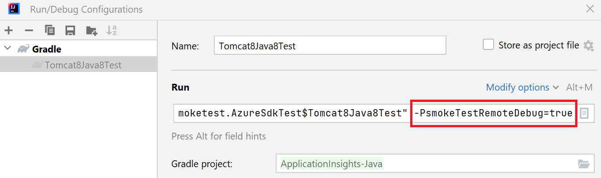
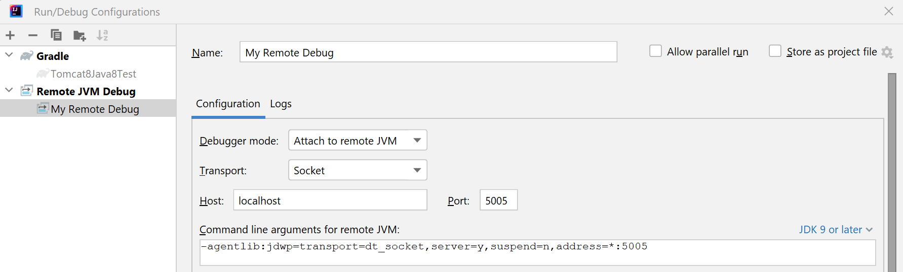

# Contributing

Pull requests for bug fixes are always welcome!

Before submitting new features or changes to current functionality, it is recommended to first
[open an issue](https://github.com/microsoft/ApplicationInsights-Java/issues/new)
and discuss your ideas or propose the changes you wish to make.

## Building

In order to build and test this whole repository you need JDK 11+.

### Building from source

Build using Java 11+:

```bash
java -version
```

```bash
./gradlew assemble
```

and then you can find the java agent artifact at

`agent/agent/build/libs/applicationinsights-agent-<version>.jar`.

## IntelliJ setup and troubleshooting

See [IntelliJ setup and troubleshooting](https://github.com/open-telemetry/opentelemetry-java-instrumentation/blob/main/docs/contributing/intellij-setup-and-troubleshooting.md)
from the OpenTelemetry Java Instrumentation project.

## Style guide

See the [style guide](https://github.com/open-telemetry/opentelemetry-java-instrumentation/blob/main/docs/contributing/style-guideline.md).
from the OpenTelemetry Java Instrumentation project.

## Running a smoke test in Intellij

Pick the smoke test that you want to run, e.g. `MongoTest`.
If the smoke test is abstract, then pick one of its subclasses, e.g. `MongoTest$Tomcat8Java8Test`.
Right-click on it and select run.

## Debugging a smoke test in Intellij

Add `-PsmokeTestRemoteDebug=true` to the gradle args, e.g.



Then create a Remote JVM Debug configuration, e.g.



Then run (not debug) the smoke test as above in [Running the smoke tests from Intellij](#running-a-smoke-test-in-intellij).

The JVM inside the container will wait remote debugger to be attached before starting.

Then go to Run > Debug, and select your Remote JVM Debug configuration.

## Error prone

While developing, if you find errorprone is getting in your way (e.g. it won't let you add
`System.out.println` to your code), you can disable it by adding the following to your
`~/.gradle/gradle.properties`:

```
disableErrorProne=true
```
