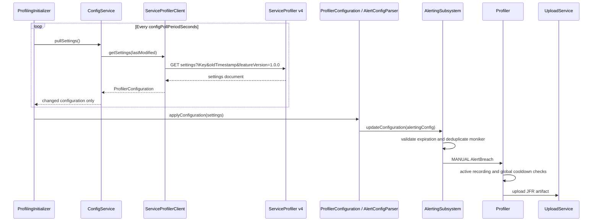

# ADR: Java Agent Support for Targeted Profile Now

- **Status:** Proposed
- **Repository:** `microsoft/ApplicationInsights-Java`
- **Service contract:**
  `ServiceProfiler/documentation/ADR/targeted_profile_now/profilenow_adr_plan.md`
- **Portal contract:**
  `MGMT-AppInsights-InsightsPortal/docs/adr/targeted_profile_now/profilenow_adr_portal_plan.md`
- **Settings protocol version:** `2.0.0`

## 1. Context

Application Insights Profiler currently receives remote settings by polling the ServiceProfiler v4
settings endpoint. An on-demand request is represented by the legacy `collectionPlan` command-line
string. Every agent attached to the Application Insights resource receives the same document and can
act on that request.

ServiceProfiler is adding an optional structured `targetedCollectionPlan` to the existing v4
settings document. The portal will use this object to target compatible Java agents by cloud role or
by role-qualified instance. Existing .NET profilers and older Java agents must remain unaffected: a
targeted write leaves the legacy `collectionPlan` empty, and clients that do not understand the new
object do nothing.

This repository owns the Java consumer described as out of scope by the ServiceProfiler ADR. The
Java agent must deserialize the structured plan, determine whether its local role and instance are
selected, and route a valid selected plan through the existing manual JFR profiling and upload
pipeline.

ServiceProfiler accepts targeted writes only through the DataPlane
`/api/apps/{appid}/targetedCollectionplan` endpoint. It does not add a targeted route to the
deprecated Web Stamp gateway. Concurrent targeted and broadcast writes retain the settings
document's existing last-write-wins behavior.

## 2. Goals

- Support targeted profiling of one or more Java role instances.
- Support targeted profiling of every Java agent instance in one or more cloud roles.
- Preserve the current explicit broadcast behavior based on the legacy `collectionPlan`.
- Reuse the existing settings poll, manual profile trigger, JFR recording, upload, active-recording
  guard, and global cooldown.
- Enforce target matching, expiration, duration, and exactly-once behavior in the Java agent.
- Provide sufficient diagnostics to explain whether a targeted request was accepted, ignored,
  rejected, blocked, recorded, or uploaded.
- Keep the change additive and compatible with settings documents from before and after the service
  rollout.

## 3. Existing Java architecture



Relevant behavior already in the repository:

- `ServiceProfilerClient` polls `api/profileragent/v4/settings` with `oldTimestamp` and feature
  version `1.0.0`.
- `ConfigService` emits only settings with a changed `lastModified` value.
- ServiceProfiler can return `304 Not Modified`, but the current `ServiceProfilerClient.handle`
  treats every status greater than or equal to 300 as an error. Targeted profiling must correct this
  so unchanged polls complete without a configuration or error.
- `ProfilerConfiguration` manually deserializes the settings JSON and skips unknown fields.
- `AlertConfigParser` converts the legacy collection-plan string into `CollectionPlanConfiguration`,
  including the .NET `DateTime.ToBinary()` expiration.
- `AlertingSubsystem` accepts unexpired immediate single plans and deduplicates them by
  `settingsMoniker` for the lifetime of the process.
- `Profiler` rejects overlapping recordings, applies the configured global cooldown, records JFR,
  and delegates upload.
- `UploadService` already carries the resolved role name and role instance/machine name in profile
  metadata.
- `ProfilingInitializer` receives `Configuration.role.name` and `Configuration.role.instance`; these
  are the same resolved identities used by telemetry and therefore are the authoritative local
  values for matching.

## 4. Decision

### 4.1 Consume the additive v4 contract

Change the profiler settings feature version sent by `ServiceProfilerClient` from `1.0.0` to
`2.0.0`. ServiceProfiler maps both values to the existing v4 settings container; this advertises
that the Java client understands `targetedCollectionPlan` and does not introduce a new endpoint or
storage version.

Continue accepting old settings documents that omit `targetedCollectionPlan`. Unknown future fields
must continue to be ignored.

Model the structured contract with immutable-by-convention Java types owned by the profiler
configuration package:

```jsonc
"targetedCollectionPlan": {
  "roles": ["frontend"],
  "immediateProfilingDuration": 120,
  "expiration": "2026-07-24T14:03:12.4470000Z",
  "settingsMoniker": "Portal_9c2e5b31"
}
```

or:

```jsonc
"targetedCollectionPlan": {
  "instances": [
    { "role": "frontend", "name": "vm-1" }
  ],
  "immediateProfilingDuration": 120,
  "expiration": "2026-07-24T14:03:12.4470000Z",
  "settingsMoniker": "Portal_9c2e5b31"
}
```

Exactly one of `roles` or `instances` is populated. The presence of the object means "profile
immediately, once"; `single` and `mode` are intentionally not serialized. ServiceProfiler trims,
case-insensitively deduplicates, and deterministically orders the selected dimension before
persistence.

### 4.2 Match against resolved Java resource identity

Target matching is local and uses the role and instance passed into `ProfilingInitializer`:

| Plan dimension | Selected when                                                                                    |
|----------------|--------------------------------------------------------------------------------------------------|
| `roles`        | The local cloud role equals one listed role, case-insensitively.                                 |
| `instances`    | One entry's role and name both equal the local cloud role and role instance, case-insensitively. |

Matching rules:

- Trim values before comparison and use `Locale.ROOT` case normalization.
- Instance identity is always the pair `(role, name)`; never match a bare instance name.
- An absent plan, null list, empty list, blank identity, null entry, both dimensions, or neither
  dimension selects nothing.
- If local role identity is absent or blank, no targeted plan can match.
- If local instance identity is absent or blank, role targeting may still match, but instance
  targeting cannot.
- Do not reinterpret an invalid targeted plan as legacy broadcast.
- Log only bounded decision metadata. Do not log the full target list or settings payload.

The portal normalizes instance names to lowercase and deduplicates case-insensitively.
Case-insensitive agent matching preserves compatibility without requiring the Java agent to mutate
its configured identity.

### 4.3 Preserve targeted configuration through the alerting boundary

`AlertConfigParser.toAlertingConfig` parses the two on-demand representations independently:

1. The legacy `collectionPlan` continues to map to `CollectionPlanConfiguration`.
2. The structured object maps faithfully to a separate `TargetedCollectionPlanConfiguration` on
   `AlertingConfiguration`, without matching it or replacing the legacy plan with a synthetic
   disabled plan.

When a targeted plan is present, it takes precedence over the legacy collection plan. The parser
retains both representations, but enablement and dispatch evaluate only the targeted plan.

The targeted configuration preserves:

- expiration parsed from the ISO-8601 string into an `Instant`;
- duration in seconds;
- `settingsMoniker` for deduplication and correlation.

Defensive client validation accepts duration values from 1 through 360 seconds. Values outside that
range do not trigger profiling; they are not clamped. Expired plans do not trigger. A targeted plan
cannot enable CPU, memory, request, periodic, file, or JMX triggers; those remain independently
configured.

### 4.4 Resolve targeting in the alerting subsystem

`TargetedCollectionPlanConfiguration` owns validation and role/instance selection semantics.
`ProfilingInitializer` uses those semantics when deciding whether a targeted request should enable
the profiler. `AlertingSubsystem` receives the same local identity and evaluates targeted and legacy
manual plans separately, sharing moniker deduplication and `MANUAL` breach creation.

`AlertPipelines` remains responsible only for telemetry analysis pipelines. Targeted selection does
not belong there because it is configuration-driven, does not consume telemetry data points, and
requires process role/instance identity.

The resulting request continues through `Profiler`, so it is subject to:

- one active recording per process;
- global cooldown across all trigger sources;
- the manual-trigger JFR configuration;
- existing upload retry/error handling;
- role and machine metadata on the uploaded artifact.

A request rejected because a recording or cooldown is active remains consumed under current
behavior. It is not retried automatically on the next unchanged settings poll. This avoids delayed
execution after the portal request's intended immediate window, but must be surfaced through
diagnostics.

### 4.5 Bound exactly-once state

The current `manualTriggersExecuted` set grows for the lifetime of the process. Targeted requests
should replace this with a bounded moniker tracker shared by legacy and targeted on-demand plans.

The tracker should:

- reject an empty or blank moniker;
- mark a moniker before dispatch to prevent duplicate concurrent execution;
- retain entries only through the maximum useful replay window;
- enforce a fixed upper bound as defense in depth;
- use the injected `TimeSource` for deterministic tests.

Because service-generated targeted requests expire after five minutes, retaining monikers for at
least the expiration window is sufficient to prevent a settings replay from executing twice. The
precise retention and capacity constants should be named and covered by tests.

Process restart resets this in-memory state. Expiration remains the cross-restart safety boundary;
no disk persistence is proposed.

### 4.6 Preserve and verify result correlation

The existing Java code uses `settingsMoniker` only for in-process deduplication; it is not
propagated into `AlertBreach`, `ServiceProfilerIndex`, or upload metadata. The service and portal
ADRs require moniker-based progress/result correlation.

Before implementation, the ServiceProfiler owner and Java owner must confirm the expected artifact
or telemetry field for this moniker. The implementation must then carry the moniker from
`CollectionPlanConfiguration` through the manual `AlertBreach` and upload/index path without
changing non-manual trigger metadata. This is a release-blocking contract decision, not an optional
telemetry enhancement.

## 5. Proposed code changes

### Phase 1: Wire contract and protocol version

- **Modify**
  `agent/agent-tooling/src/main/java/com/microsoft/applicationinsights/agent/internal/profiler/service/ServiceProfilerClient.java`
  - Send `featureVersion=2.0.0`.
  - Keep the v4 route, `iKey`, and `oldTimestamp` behavior unchanged.
  - Treat `304 Not Modified` as an empty result and continue treating other non-success responses as
    failures.
- **Create** typed targeted-plan and target-instance models under
  `agent/agent-tooling/src/main/java/com/microsoft/applicationinsights/agent/internal/profiler/config/`.
- **Modify** `ProfilerConfiguration.java`
  - Add nullable `targetedCollectionPlan` accessors.
  - Parse and serialize the nested object with `azure-json`.
  - Continue skipping unknown fields at every object level.
  - Treat absent or explicit null as no targeted plan.

Acceptance criteria:

- Old settings documents deserialize unchanged.
- Roles and instances variants round-trip with exact camelCase field names.
- The wire model contains only the selected dimension, `immediateProfilingDuration`, ISO-8601
  `expiration`, and `settingsMoniker`.
- Unknown nested fields are ignored.
- Malformed JSON fails the settings pull without partially applying a plan.
- Settings requests advertise `2.0.0`.
- An unchanged settings poll returns no configuration and does not log an error.

### Phase 2: Identity matching and validation

- **Create** `TargetedCollectionPlanConfiguration` in the alerting API with validation and matching
  semantics.
- **Modify** `ProfilingInitializer.java` to use the typed plan when deciding whether to enable the
  profiler. Do not add identity to the settings URL.
- **Modify** `AlertConfigParser.java` to parse the targeted plan independently of the legacy plan.
- **Modify** `AlertingSubsystem.java` to receive local identity and evaluate targeted dispatch.

Acceptance criteria:

- Role matching is case-insensitive.
- Instance matching requires both role and name.
- Duplicate instance names in different roles remain distinct.
- Empty, mixed, null, malformed, invalid-expiration, blank-moniker, invalid-duration, and unmatched
  plans trigger nothing.
- Missing instance identity still permits role matching but not instance matching.
- A document containing both legacy and targeted plans evaluates only the targeted plan.

### Phase 3: Scheduling, deduplication, and correlation

- **Modify**
  `agent/agent-profiler/agent-alerting/src/main/java/com/microsoft/applicationinsights/alerting/AlertingSubsystem.java`
  - Reuse final collection-plan checks.
  - Replace the unbounded executed-moniker set with a bounded tracker.
  - Emit a decision outcome for selected, expired, duplicate, or invalid plans.
- **Modify** alert and upload contracts only as required by the confirmed ServiceProfiler
  moniker-correlation contract:
  - `agent/agent-profiler/agent-alerting-api/.../alert/AlertBreach.java`
  - `agent/agent-tooling/.../profiler/upload/ServiceProfilerIndex.java`
  - `agent/agent-tooling/.../profiler/upload/UploadService.java`

Acceptance criteria:

- A selected moniker is dispatched no more than once per process within the retention window.
- Expiration prevents replay after process restart.
- Targeted recording uses the requested duration and the manual JFR configuration.
- Active-recording and global-cooldown behavior remains unchanged.
- The confirmed moniker field is present on successful targeted output and absent where
  inappropriate.

### Phase 4: Diagnostics and supportability

Add low-cardinality diagnostics for:

- settings protocol version in use;
- targeted plan received;
- selected by role or instance;
- not selected;
- invalid contract;
- expired;
- duplicate moniker;
- blocked by active recording;
- blocked by global cooldown;
- recording started;
- upload succeeded or failed.

Diagnostics must not include target arrays, instrumentation keys, connection strings, upload tokens,
or unbounded user-controlled values. The existing `"StartProfiler triggered."` telemetry event
should remain for backend compatibility unless the service owner approves a replacement.

### Phase 5: Documentation and release metadata

- Add an entry to `CHANGELOG.md` when implementation ships.
- Document the first Java agent version that supports targeting.
- Provide the accepted heartbeat `sdkVersion` prefix set and minimum semantic version to the portal
  owner.
- Do not add a user-facing `applicationinsights.json` switch; availability is controlled by agent
  version, service deployment, and the portal feature flag.

## 6. Testing strategy

### Unit tests: contract and protocol

Extend `ProfilerConfigurationTest` and add focused model tests for:

- roles and instances JSON shapes;
- null and absent targeted plan;
- exact camelCase names;
- unknown fields;
- malformed and incomplete nested objects;
- ISO-8601 expiration parsing, including the service's seven-digit fractional seconds;
- settings feature version `2.0.0` in the generated request URL.
- HTTP 200 parsing, HTTP 304 empty completion, and non-304 error responses.

Avoid adding live service dependencies. Prefer the existing HTTP playback or a local mocked pipeline
for request inspection.

### Unit tests: matching and mapping

Extend `AlertConfigParserTest`, `AlertingSubsystemTest`, or add a dedicated matcher test class for:

- role and role-instance matches;
- case and whitespace normalization;
- repeated instance names across different roles;
- unmatched targets;
- missing local identities;
- roles XOR instances invariant;
- null entries and blank values;
- valid duration boundaries 1 and 360;
- invalid duration values 0 and 361;
- expired, malformed-expiration, and blank-moniker plans;
- targeted-plan precedence when legacy and targeted plans coexist.

### Unit tests: scheduling and safety

Extend `AlertingSubsystemTest`, `ProfilingInitializerTest`, and `ProfilerGlobalCooldownTest` for:

- one dispatch for a new targeted moniker;
- no dispatch for the same moniker on repeated settings updates;
- bounded moniker retention and eviction;
- selected plans enabling the profiler when no other remote trigger is enabled;
- unmatched plans not enabling the profiler solely because they exist;
- active recording and global cooldown blocking targeted requests without changing current trigger
  semantics;
- targeted duration reaching the JFR recording scheduler;
- expiration evaluated through the injected time source.

### Upload and correlation tests

Extend `UploadServiceTest` and `UploadServiceSimpleTest` to verify:

- existing role and machine metadata is unchanged;
- the agreed settings-moniker correlation field is emitted for targeted manual profiles;
- CPU, memory, request, file, JMX, and legacy behaviors do not gain incorrect targeted metadata;
- rejected or failed profiles do not report successful targeted completion.

### Smoke tests

Extend the fake settings service in:

-
`smoke-tests/framework/src/main/java/com/microsoft/applicationinsights/smoketest/fakeingestion/ProfilerState.java`
-
`smoke-tests/framework/src/main/java/com/microsoft/applicationinsights/smoketest/fakeingestion/MockedProfilerSettingsServlet.java`

Add JavaProfiler smoke scenarios using the configured identity `testrolename` / `testroleinstance`:

1. Matching role starts one JFR profile and upload.
2. Matching role-qualified instance starts one profile.
3. Same instance name under a different role does not start a profile.
4. Unmatched role does not start a profile.
5. Expired plan does not start a profile.
6. Repeated settings/moniker starts only once.
7. Legacy `collectionPlan` still starts a broadcast profile.
8. Old settings without the new object remain valid.

Run a focused environment first, for example Java 17, before the normal supported Java matrix. Keep
durations short enough for reliable smoke execution while respecting the minimum duration contract.

### Cross-repository end-to-end tests

Before portal enablement, validate against a deployed ServiceProfiler environment:

- targeted single instance;
- duplicate instance names in different roles;
- whole-role targeting;
- unmatched Java agent;
- expiration before poll;
- repeated unchanged and changed settings;
- mixed old/new Java and .NET fleet;
- moniker-correlated result visible in the portal;
- legacy broadcast still reaches compatible Java and .NET agents.

## 7. Compatibility and security

### Compatibility

- The settings endpoint and v4 document remain unchanged except for the optional object.
- Older Java agents continue sending `1.0.0`, ignore the unknown object, observe an empty legacy
  plan, and do nothing.
- New Java agents accept documents without the object and preserve legacy broadcast behavior.
- .NET agents are unchanged and remain outside this repository.
- The new Java models must tolerate additive future fields.
- Java 8 source/runtime compatibility must be preserved despite testing newer JVMs.

### Security and operational safety

- Continue using the existing authenticated ServiceProfiler endpoint and HTTP pipeline.
- Do not accept expiration or moniker from local untrusted inputs; they arrive through the existing
  service settings channel.
- Treat malformed server state as non-actionable rather than as broadcast.
- Enforce duration limits in the agent even though the service validates them.
- Retain active-recording and global-cooldown controls to bound CPU, disk, memory, and upload
  impact.
- Do not log credentials, full settings payloads, or complete target lists.
- Continue writing recordings only under the configured writable temporary directory and deleting
  them according to existing upload behavior.

## 8. Deployment and rollback

Implement across repositories in this order:

1. Complete and validate the Java agent consumer with the portal feature flag still disabled.
2. Publish the first compatible Java heartbeat `sdkVersion` and accepted prefixes to the portal
   owner.
3. Deploy ServiceProfiler's `2.0.0`-to-v4 routing support before any production Java agent begins
   advertising `2.0.0`.
4. Release the Java agent consumer.
5. Deploy the ServiceProfiler DataPlane targeted write endpoint.
6. Run cross-repository end-to-end tests against the released Java agent.
7. Populate and validate the portal capability policy.
8. Enable `profilerTargetedProfileNow` incrementally and monitor decision, recording, and upload
   outcomes.

This refines the cross-repository statement "Java client first" into implementation order versus
production dependency order. The Java implementation must be ready first, but a released agent that
sends `2.0.0` depends on the service accepting that value. If ServiceProfiler cannot deploy protocol
routing before the public Java release, the Java client needs an agreed compatibility mechanism,
such as temporarily polling with `1.0.0`; do not silently add fallback behavior without
service-owner approval.

Rollback options:

- Disable the portal feature flag to stop new targeted writes.
- Roll back the ServiceProfiler targeted endpoints while retaining additive read compatibility.
- Roll back the Java agent release; targeted settings remain inert because legacy `collectionPlan`
  is empty.
- Preserve legacy broadcast throughout rollout and rollback.

No settings migration, Cosmos migration, or local configuration migration is required.

## 9. Risks and mitigations

| Risk                                                                            | Mitigation                                                                                                                          |
|---------------------------------------------------------------------------------|-------------------------------------------------------------------------------------------------------------------------------------|
| Poll latency consumes much of the five-minute expiration window.                | Keep existing bounded polling; measure received-to-start latency and reject expired plans.                                          |
| Service returns 304 for unchanged settings and the agent treats it as an error. | Handle 304 as an empty successful poll and add focused HTTP tests.                                                                  |
| A Java agent advertises `2.0.0` before ServiceProfiler accepts it.              | Deploy version routing first or agree on a temporary compatibility mechanism before release.                                        |
| Role identity shown by heartbeat differs from profiler identity.                | Match using the same resolved `Configuration.role` values used by Java telemetry; test App Service and runtime configuration paths. |
| Duplicate machine names cause over-selection.                                   | Require role and name together for instance targeting.                                                                              |
| Replayed settings execute twice.                                                | Check expiration and use bounded moniker deduplication before dispatch.                                                             |
| A targeted request is blocked by another profile or cooldown.                   | Preserve safety behavior and expose a distinct decision outcome.                                                                    |
| Targeted moniker cannot be correlated to uploaded results.                      | Resolve and test the ServiceProfiler artifact metadata contract before release.                                                     |
| Portal offers unsupported Java versions.                                        | Publish an explicit first supported `sdkVersion`; keep the portal threshold unset until then.                                       |
| Role targeting reaches agents absent from current inventory.                    | Accept this as an eventually consistent portal limitation; agent matching remains exact against the requested role.                 |

## 10. Open questions and release gates

The following must be resolved before implementation is considered production-ready:

1. **Moniker propagation:** Which profile artifact, index, or telemetry field must carry
   `settingsMoniker` for portal progress and result correlation?
2. **Capability identity:** What exact heartbeat `sdkVersion` prefixes identify this agent, and what
   released version is the first supported minimum?
3. **Blocked request outcome:** Does ServiceProfiler require a machine-readable acknowledgement when
   a selected request is blocked by an active recording or global cooldown, or are agent diagnostics
   sufficient?
4. **Deduplication bounds:** Confirm the moniker tracker retention period and maximum capacity. The
   proposal is a short in-memory window comfortably exceeding the five-minute request expiration.
5. **Runtime role changes:** Confirm whether environments that apply role identity after profiler
   initialization require the profiler's matching identity to be refreshable instead of captured
   once.
6. **Protocol deployment sequencing:** Confirm that ServiceProfiler will accept
   `featureVersion=2.0.0` before the first production Java agent advertises it; otherwise define the
   approved transition behavior.

Items 1, 2, and 6 are release blockers because the portal contract depends on result correlation and
version-based capability filtering, and the Java agent must retain access to remote profiler
settings during rollout.

## 11. Implementation milestones

1. **Contract-ready:** Java models deserialize both target shapes and the client advertises settings
   protocol `2.0.0`.
2. **Selection-ready:** Matching and fail-closed validation pass the complete unit matrix.
3. **Execution-ready:** Selected plans reuse the manual JFR path with expiration, bounded
   exactly-once behavior, duration limits, and existing safety controls.
4. **Correlation-ready:** Targeted monikers are visible on the agreed service output and diagnostics
   distinguish every terminal outcome.
5. **E2E-ready:** Java smoke tests and mixed-fleet ServiceProfiler tests pass.
6. **Rollout-ready:** The Java release version and heartbeat capability policy are published, the
   DataPlane service route is deployed, and the portal feature flag remains the final enablement
   control.

## 12. Consequences

### Positive

- Targeting is additive and reuses mature profiler recording and upload paths.
- No direct connectivity to customer workloads is introduced.
- Role and instance matching is deterministic and local to the agent.
- Existing Java and .NET broadcast behavior remains available.
- Rollout can be controlled independently through agent version, service deployment, and portal
  feature flag.

### Negative

- Execution latency remains bounded by polling rather than being immediate push delivery.
- Role targeting can reach agents missing from the portal's eventually consistent inventory.
- Exactly-once behavior is process-local; expiration is required to prevent replay after restart.
- Additional diagnostics and cross-repository release coordination are required.
- The current Java upload path does not yet expose the settings moniker, so correlation needs an
  explicit contract change.

## 13. Alternatives considered

### Filter settings server-side by agent identity

Rejected. The settings request does not carry cloud role, server-side inventory is unavailable, and
adding identity-aware responses would complicate caching and change detection.

### Encode targets in the legacy collection-plan string

Rejected. Older profilers could misinterpret the request, the format is difficult to evolve safely,
and structured validation would be weaker.

### Implement a separate targeted scheduler

Rejected. It would duplicate expiration, deduplication, JFR recording, cooldown, and upload
behavior. Mapping a selected typed plan into the existing manual path is smaller and safer.

### Persist executed monikers to disk

Rejected for the initial implementation. Service-generated expiration provides the cross-restart
boundary, while disk persistence adds lifecycle, locking, cleanup, and read-only-filesystem
concerns.

### Bypass global cooldown for portal-targeted requests

Rejected. A portal request must not override process safety limits or create overlapping JFR
recordings.
